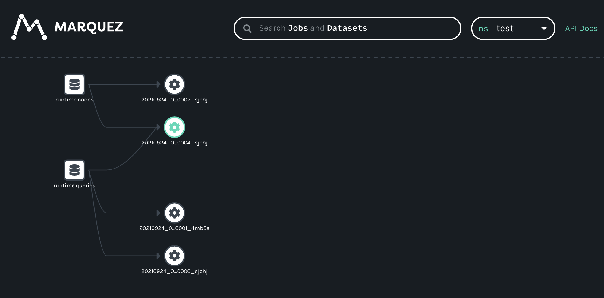

> [!CAUTION]
> This repository is no longer maintaned since OpenLineage integration has been [merged into Trino](https://github.com/trinodb/trino/pull/21265).

trino-openlineage
====

An experimental [OpenLineage](https://github.com/OpenLineage/OpenLineage) integration for [Trino](https://github.com/trinodb/trino)



## Requirements

- Java 21
- Maven
- Trino 422


## Mapping of properties

| OpenLineage        | Trino                                               |
|--------------------|-----------------------------------------------------|
| JobFacet Name      | QueryID                                             |
| JobFacet Namespace | Query Environment (or configured in event listener) |
| RunFacet ID        | QueryID                                             |


## Installation

Build and copy trino-openlineage plugin:

```sh
mvn clean install -DskipTests
unzip ./target/trino-openlineage-422.zip -d $TRINO_HOME/plugin
```

Add the following line to `$TRINO_HOME/etc/event-listener.properties`:

```properties
event-listener.name=openlineage
openlineage.url=http://localhost:5000
#openlineage.facets.trinoMetadata.enabled=false
#openlineage.facets.trinoQueryContext.enabled=true
#openlineage.facets.trinoQueryStatistics.enabled=false
#openlineage.namespace=default
#openlineage.apikey=xxxx
```

## Local testing

1. Build plugin:

```shell
mvn clean install -DskipTests
```

2. Run docker compose:

```shell
docker compose up -d
```

- Freshly built plugin will be automatically mounted to your trino pod. 
- Configuration of the plugin will be taken from `event-listener.properties` file - adjust it to your will and restart trino pod for changes to take effect.

3. Run query creating new table: 

```shell
docker exec -it oltrino trino --execute 'create table memory.default.test_table as select * from tpch.sf1.nation limit 1;'
```

4. Check logs of mock api:

```shell
docker logs olapi
```
